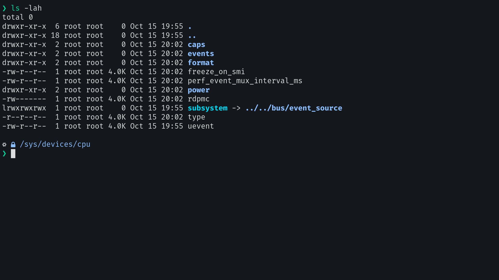

<p align="center">
    <picture>
        <source media="(prefers-color-scheme: dark)" srcset="https://raw.githubusercontent.com/perpetuatheme/perpetua/main/logo/logo_circle_dark.png">
        <source media="(prefers-color-scheme: light)" srcset="https://raw.githubusercontent.com/perpetuatheme/perpetua/main/logo/logo_circle_light.png">
        
    </picture>
    <h2 align="center">Perpetua for <a href="https://github.com/alacritty/alacritty">Alacritty</a></h2>
</p>

> [!WARNING]
> The project is under active development. Things are subject to change.

<p align="center">
    <picture>
        <source media="(prefers-color-scheme: dark)" srcset="./assets/screenshot-dark.png">
        <source media="(prefers-color-scheme: light)" srcset="./assets/screenshot-light.png">
        
    </picture>
</p>

## Usage

1. Locate (or create) your Alacritty configuration file (see [the *Configuration* section of Alacritty's README](https://github.com/alacritty/alacritty/tree/master#configuration)).

2. Clone this repository.
```
git clone https://github.com/perpetuatheme/alacritty $HOME/perpetua-alacritty
```

3. Copy the theme files next to your Alacritty configuration file.
```
cp $HOME/perpetua-alacritty/perpetua-{dark,light}.yml $XDG_CONFIG_HOME/alacritty
```

4. Choose the desired ambience and import the corresponding file into your Alacritty configuration file.
```yaml
import:
  # Uncomment the desired ambience below:
  - ~/.config/alacritty/perpetua-dark.yml
  # - ~/.config/alacritty/perpetua-light.yml
```

5. (Optional) Delete the cloned repository.
```
rm -r $HOME/perpetua-alacritty
```

## Screenshots

<details>
    <summary>Light</summary>
    <figure>
        
        <figcaption>Perpetua light ambience on Alacritty.</figcaption>
    </figure>
    <figure>
        
        <figcaption>Perpetua light ambience on Alacritty running <code>btop</code>.</figcaption>
    </figure>
    <figure>
        
        <figcaption>Perpetua light ambience on Alacritty running <code>ls</code>.</figcaption>
    </figure>
</details>

<details>
    <summary>Dark</summary>
    <figure>
        
        <figcaption>Perpetua dark ambience on Alacritty.</figcaption>
    </figure>
    <figure>
        
        <figcaption>Perpetua dark ambience on Alacritty running <code>btop</code>.</figcaption>
    </figure>
    <figure>
        
        <figcaption>Perpetua dark ambience on Alacritty running <code>ls</code>.</figcaption>
    </figure>
</details>

<br>
<hr>
<p align="center">
    <small>© Copyright 2023-present, The Perpetua Authors.</small>
</p>
